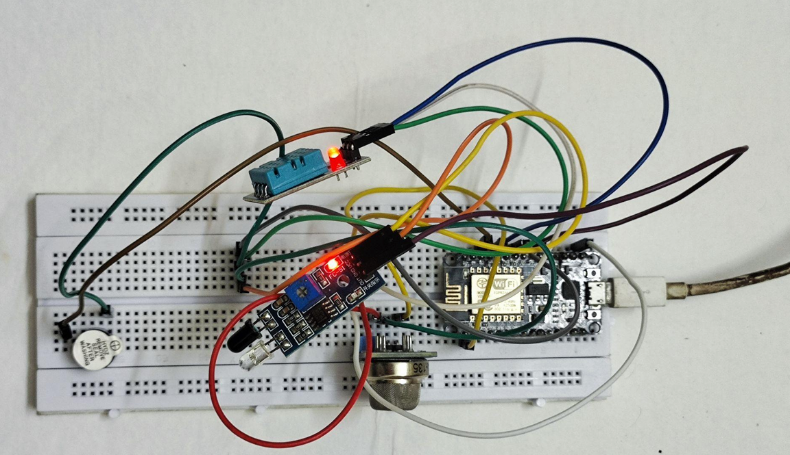
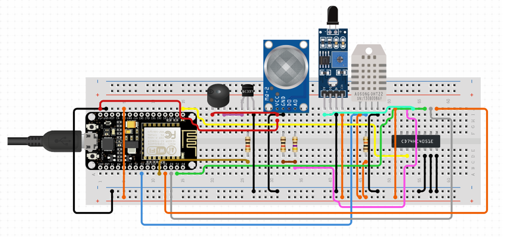
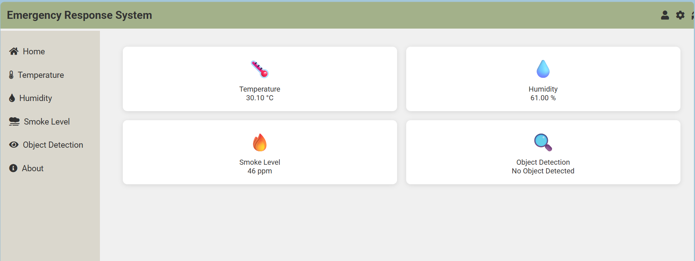
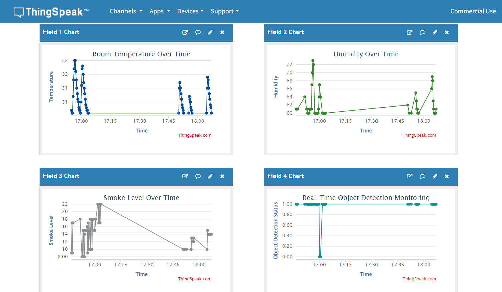
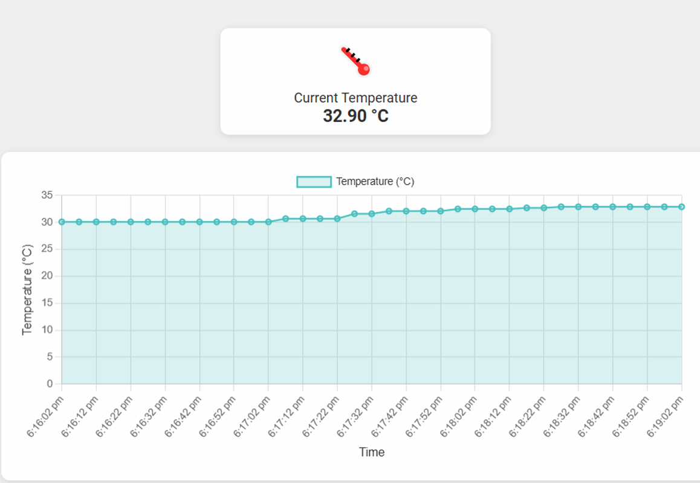
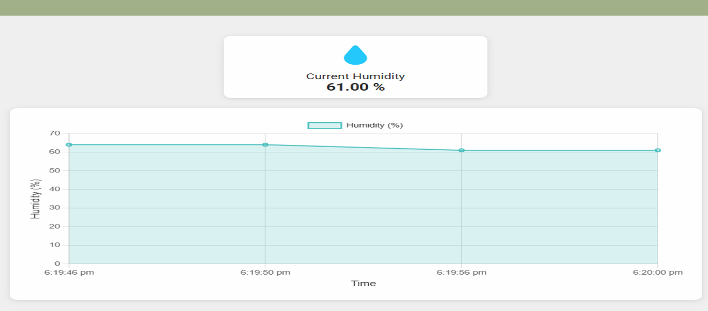
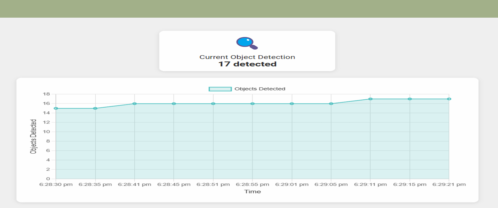
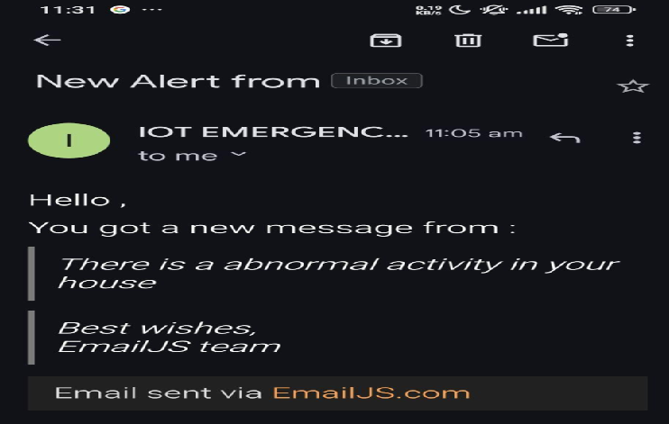

# 🚨 IoT Emergency Response System

> An IoT-based emergency monitoring system using **ESP8266 (NodeMCU)**, **DHT11**, **MQ-2**, **IR Sensor**, **ThingSpeak Cloud**, and a **real-time Web Dashboard** for hazard detection and remote monitoring.


---

# 📖 Project Overview

The **IoT Emergency Response System** is an intelligent IoT solution designed to continuously monitor environmental conditions using multiple sensors connected to an **ESP8266 NodeMCU**.

The system detects hazardous situations such as:

- 🌡️ High Temperature
- 💧 High Humidity
- 🔥 Smoke / Gas Leakage
- 👀 Object Detection

Whenever predefined thresholds are exceeded, the system:

- 🔔 Activates a Buzzer
- 💡 Turns on an LED Warning
- ☁️ Uploads sensor data to ThingSpeak Cloud
- 📊 Updates a live Web Dashboard
- 🌐 Enables remote monitoring over Wi-Fi

---

# ✨ Features

- ✅ Real-time Temperature Monitoring
- ✅ Humidity Monitoring
- ✅ Smoke & Gas Detection
- ✅ IR-based Object Detection
- ✅ Automatic LED & Buzzer Alerts
- ✅ ThingSpeak Cloud Integration
- ✅ Live Web Dashboard
- ✅ Remote Monitoring

---

# 🛠 Hardware Components

| Component | Purpose |
|-----------|---------|
| ESP8266 NodeMCU | Main Controller |
| DHT11 | Temperature & Humidity |
| MQ-2 | Smoke & Gas Detection |
| IR Sensor | Object Detection |
| LED | Visual Alert |
| Buzzer | Audio Alert |
| Breadboard & Jumper Wires | Circuit Connections |

---

# 💻 Software & Technologies

- Arduino IDE
- HTML
- CSS
- JavaScript
- ThingSpeak API
- ESP8266 Wi-Fi Library

---

# 🏗️ System Architecture

```text
                DHT11
                   │
MQ-2 ──────────────┤
                   ▼
            ESP8266 NodeMCU
                   │
          Threshold Detection
          │                 │
          ▼                 ▼
     LED + Buzzer     ThingSpeak Cloud
                              │
                              ▼
                      Web Dashboard
                              │
                              ▼
                    Remote Monitoring
```

---

# 🔄 System Workflow

```text
Start
   │
   ▼
Read Sensor Values
   │
   ▼
Threshold Check
   │
   ├── Safe
   │      │
   │      ▼
   │ Upload Data to ThingSpeak
   │
   └── Hazard Detected
          │
          ▼
 Activate LED & Buzzer
          │
          ▼
 Upload Data to ThingSpeak
          │
          ▼
 Update Dashboard
          │
          ▼
 Repeat
```

---

# 🔌 Circuit Connections

| Component | ESP8266 Pin |
|------------|-------------|
| DHT11 | D4 |
| MQ-2 | A0 |
| IR Sensor | D6 |
| LED | D5 |
| Buzzer | D2 |

---

# 📸 Project Screenshots

## 🏠 Hardware Setup

> *(Upload `assets/hardware-setup.png`)*



---

## 🔌 Circuit Diagram

> *(Upload `assets/circuit-diagram.png`)*



---

## 📊 Web Dashboard

> *(Upload `assets/dashboard.png`)*



---

## ☁️ ThingSpeak Dashboard

> *(Upload `assets/thingspeak.png`)*



---

## 🌡️ Temperature Monitoring

> *(Upload `assets/temperature.png`)*



---

## 💧 Humidity Monitoring

> *(Upload `assets/humidity.png`)*



---

## 🔥 Smoke / Object Detection

> *(Upload `assets/object-detection.png`)*



---

## 📧 Email Notification

> *(Upload `assets/email-alert.png`)*



---

# 📂 Repository Structure

```text
IoT-Emergency-Response-System
│
├── Arduino/
├── Web-Dashboard/
├── Documentation/
├── assets/
├── Screenshots/
├── README.md
├── LICENSE
└── .gitignore
```

---

# 🚀 Getting Started

### Clone the Repository

```bash
git clone https://github.com/charan23k2004/IoT-Emergency-Response-System.git
```

### Setup

1. Install Arduino IDE.
2. Install the ESP8266 Board Package.
3. Install the required libraries:
   - DHT Sensor Library
   - ESP8266WiFi
   - ESP8266HTTPClient
4. Update your Wi-Fi credentials.
5. Add your ThingSpeak API Key.
6. Upload the sketch to the ESP8266.

---

# 📈 Future Enhancements

- 📱 Android Application
- 📡 MQTT Communication
- ☁️ Firebase Integration
- 🤖 AI-based Anomaly Detection
- 📲 Push Notifications

---

# 👥 Team Members

- Charan K
- Naveen S S
- Sachin Karthik V
- Sivaraman S
- Vijayabaskar

---

# 📜 License

This project is licensed under the MIT License.

---

## ⭐ Support

If you found this project useful, please consider giving it a ⭐ on GitHub.
