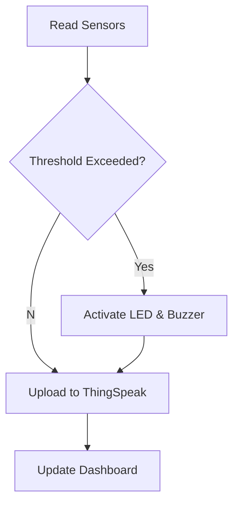

# 🚨 IoT Emergency Response System


## 📌 Overview
An IoT-based emergency monitoring system built using **NodeMCU ESP8266**, **DHT11**, **MQ-2**, and **IR Sensor**. The system continuously monitors environmental conditions, activates local alerts (LED/Buzzer), uploads readings to **ThingSpeak**, and displays live information through an HTML/CSS/JavaScript dashboard.

## ✨ Features
- 🌡️ Temperature & humidity monitoring
- 🔥 Smoke/Gas detection
- 👁️ IR-based object/flame detection
- 🔔 Automatic buzzer & LED alerts
- ☁️ ThingSpeak cloud integration
- 📊 Live web dashboard
- 🌐 Remote monitoring

## 🧰 Hardware
| Component | Purpose |
|-----------|---------|
| ESP8266 NodeMCU | Controller & Wi-Fi |
| DHT11 | Temperature & Humidity |
| MQ-2 | Smoke/Gas Detection |
| IR Sensor | Object Detection |
| LED & Buzzer | Local Alerts |

## 🏗️ System Architecture
```text
Sensors
  │
  ▼
ESP8266 NodeMCU
  │
  ├── Threshold Detection
  ├── LED/Buzzer Alert
  ├── ThingSpeak Cloud
  ▼
Web Dashboard
```

## 🔄 Workflow


## 🚀 Getting Started
1. Install Arduino IDE.
2. Install ESP8266 board support.
3. Install required libraries (DHT, ESP8266WiFi, ESP8266HTTPClient).
4. Update Wi-Fi credentials and ThingSpeak API key.
5. Upload the sketch to NodeMCU.
6. Open the dashboard HTML files in a browser.

## 📷 Screenshots
Add these images after uploading:
- Hardware Setup
- Circuit Diagram
- Dashboard
- ThingSpeak Charts
- Email Alert

## 📁 Repository Structure
```
Arduino/
Web-Dashboard/
Documentation/
Screenshots/
README.md
```

## 💡 Future Enhancements
- MQTT support
- Mobile app
- Firebase integration
- AI-based anomaly detection
- Push notifications

## 📚 Lessons Learned
- Sensor calibration is critical.
- Cloud latency should be handled gracefully.
- Modular code improves maintainability.
- Real-time monitoring improves safety.

## 👨‍💻 Author
**Charan K** (Team Project)
